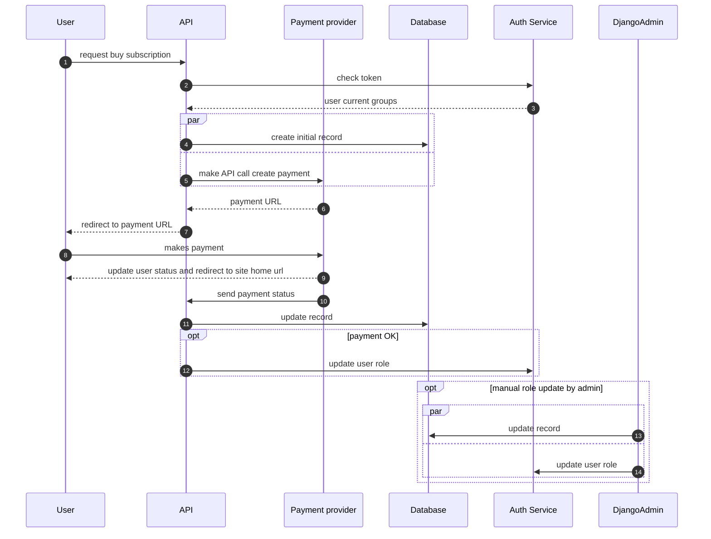

# Draft

```mermaid
flowchart LR

P(((Payment provider\n create payment\n generate link)))
BP[User]
subgraph API
    WH(Web hook API:\n New payments \n Cancel payments)
    BC(Billing \n APIs)
    C{{ Tasks:\n New payment \n Cancel payment}}
    C2{{ Task: \n New payment \n Cancel payment}}
end
DB[(Payments database\n AdminPortal DB)]
C3{{ Task update user role}}

AP(Auth service)
NS(Notification service)
RQ[[Notification queue]]
CH{Payment OK?}
DJ(Django web interface\n AdminPortal)
P2(((Payment provider \n notify after\n processing)))
ELK[(ELK)]
TV(Auth service)
ETL1((recurrent payments \n periodic task))

BP -- 1. billing request --> BC
BC -- 2. verify token --> TV
TV -. 3. user current group .-> BC
BC -- 4. --> C
C -- 5. create initial payment record --> DB
C -- "5. get payment URL" --> P
P -. "6. provide payment URL" .-> C
C -. 7. redirect URL .-> BC
BC -. 8. redirect to payment page .->BP

P2 -- 9. send status --> WH
WH -- 10. start task --> C2
C2 -- 11. update record status --> DB
C2 -- 12. --> CH
CH -- 13. YES --> C3
C3 -- 14. update user group via API call--> AP
C3 -- 14. put notificaion in queue --> RQ
RQ <-- 15. send notification to user --> NS
DB <-- admin interface --> DJ
DJ -. manual user group assigment\n option for admin .-> C3

C -- logging payment response --> ELK
C2 -- loging payment response --> ELK

ETL1 --> DB

style BP fill:orange
style P fill:cyan
style P2 fill:cyan
style AP fill:pink
style NS fill:pink
style RQ fill:pink
style ELK fill:pink
style TV fill:pink

```
## Example Sequence new payment

